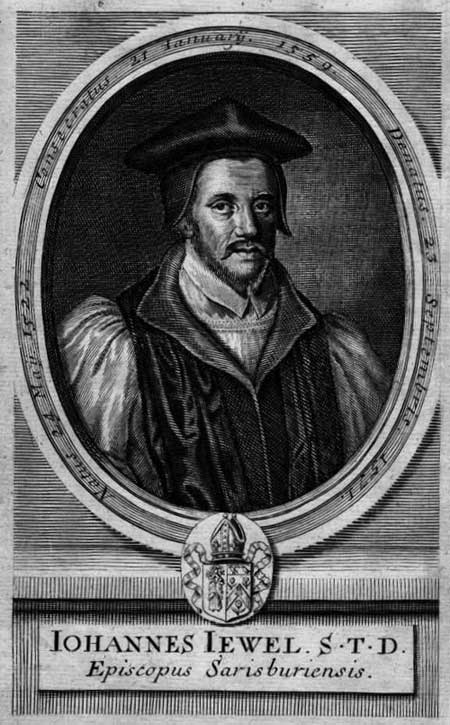

**John Jewel** (1522–1571) was Bishop of Salisbury and one of the most important defenders of the Elizabethan Settlement. His *Apology of the Church of England* (1562) became the foundational statement of Anglican self-understanding in relation to Rome and the early Church.

## Life

Jewel was born on 24 May 1522 at Buden, near Ilfracombe in Devonshire. He studied at Oxford, where he became tutor and preacher, graduating B.D. in 1551. He was a close friend and disciple of Peter Martyr Vermigli, the Italian Reformer who held the chair of Divinity at Oxford under Edward VI.

At the accession of Queen Mary, Jewel initially bowed to royal authority, but soon repented and followed Peter Martyr to Strasburg, where he became vice-master of a college. Upon Elizabeth's accession in 1558, he returned to England and was one of sixteen Protestants appointed by the Queen to dispute publicly with Catholic representatives.

In 1559 Jewel was appointed a commissioner for securing conformity with the reformed Church service in the West of England, and before the end of the year he was consecrated Bishop of Salisbury. He was zealous in all duties of his charge and was an early patron of the young Richard Hooker. Jewel shortened his life by limiting himself to four hours of sleep, taken between midnight and four in the morning. He died on 21 September 1571, before reaching the age of fifty.

## Works

### An Apology of the Church of England (1562)

The *Apologia Ecclesiae Anglicanae* was written in Latin to be read throughout Europe as the answer of the Reformed Church of England to those who accused it of innovation. Jewel argued that the English Reformers were returning to the old Church, not creating a new one, and demonstrated this by appeal to Scripture, the early Church Fathers, and the first centuries of Christianity.

The work was translated into English by Lady Ann Bacon (mother of Francis Bacon) in 1564, with the translation revised by Archbishop Matthew Parker. It remains the most important early Anglican apologetic work.

- [Introduction](/anglican-divines/john-jewel/apology-introduction/)
- [Part I](/anglican-divines/john-jewel/apology-part-1/) — The truth has always been slandered
- [Part II](/anglican-divines/john-jewel/apology-part-2/) — The positive statement of Anglican faith
- [Part III](/anglican-divines/john-jewel/apology-part-3/) — Defence against charges of heresy and schism
- [Part IV](/anglican-divines/john-jewel/apology-part-4/) — The moral failings of Rome; the Church may err
- [Part V](/anglican-divines/john-jewel/apology-part-5/) — Antiquity is on the Reformers' side
- [Part VI](/anglican-divines/john-jewel/apology-part-6/) — On councils, the authority of princes, and the papacy
- [Recapitulation](/anglican-divines/john-jewel/apology-recapitulation/)
